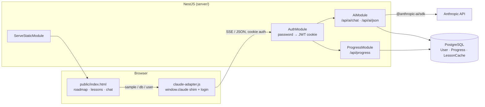

# 🍌 Banana Path

[](https://github.com/umidulloh-dev/banana-path/actions/workflows/ci.yml)

A Duolingo-style course for Node.js and TypeScript, where every lesson is written
on demand by Claude. The learner walks a roadmap of units, the mentor generates
cards and exercises for the node they tapped, reviews the code they submit, and
answers follow-up questions in a chat — while XP, bananas and a daily streak keep
the habit going.

Originally the frontend ran on claude.ai and leaned on three platform
capabilities (`sample`, `db`, `user`). This repository turns it into a
self-hosted site: a NestJS backend now owns the Anthropic calls and the
progress storage, and a small adapter rebuilds the same `window.claude` API in
the browser, so the original single-file frontend runs unchanged.

> **Screenshot:** add `docs/screenshot.png` and it will render here.
>
> 

---

## Architecture



**How the three platform capabilities were replaced**

| Was (claude.ai) | Now |
| --- | --- |
| `sample(input, { onText, signal })` | `POST /api/ai/chat` — Server-Sent Events; closing the connection aborts the upstream request |
| `sample.json(prompt)` | `POST /api/ai/json` — the answer is parsed, or 422; identical prompts are cached for 24h |
| `db.doc(...)` + `user.id()` | `GET/PUT /api/progress` and `GET /api/me`, keyed by the session cookie |

The API key never reaches the browser, and every `/api/*` route sits behind a
global auth guard.

### The lesson pack

Lessons do not change between openings, so regenerating them per visit would
spend credits on identical content. They are built once into
`public/lessons/<node-id>.json` and served as static files: opening a lesson is
instant and costs nothing. The model is reserved for what is actually
per-student — reviewing the code you submit, and the mentor chat.

```bash
node scripts/build-lessons.mjs --base https://<host> --password <APP_PASSWORD>
node scripts/build-lessons.mjs --dry-run          # list what would be built
node scripts/build-lessons.mjs --only ts-generics # rebuild one topic
```

The script reads `UNITS` and `lessonPrompt` straight out of `public/index.html`
rather than restating them, so the pack cannot drift from what the app itself
would have asked for. It validates every answer the way the frontend does, skips
lessons already on disk, and is safe to rerun after a failure.

A node with no file in the pack still works — the app falls back to generating
it live, so the roadmap can grow before the pack catches up.

### Request lifecycle of a generated lesson

1. The learner taps a node; the frontend calls `sample.json(lessonPrompt(...))`.
2. The adapter posts the prompt to `/api/ai/json` with the session cookie.
3. The guard checks the JWT; the rate limiter checks the per-user AI budget.
4. `LessonCacheService` hashes model + prompt and looks for a fresh row.
5. On a miss, `AnthropicService` streams a completion and `extractJson` pulls
   the JSON out of it — directly, from a fenced block, or by slicing between the
   outermost brackets. Anything else is a `422 invalid_json`.
6. The parsed lesson is cached and returned.

---

## Tech stack

- **Backend** — NestJS 11, TypeScript in `strict` mode, zod for every boundary
- **Database** — PostgreSQL with Prisma
- **AI** — `@anthropic-ai/sdk`, model chosen via `ANTHROPIC_MODEL`
- **Frontend** — the original single-file app, served as a static asset
- **Infra** — multi-stage Dockerfile, docker-compose for development, Railway for production, GitHub Actions for CI

---

## Running it locally

**Requirements:** Node.js 22+, Docker (for PostgreSQL), an Anthropic API key.

```bash
git clone https://github.com/umidulloh-dev/banana-path.git
cd banana-path
cp .env.example .env          # then fill in ANTHROPIC_API_KEY, APP_PASSWORD, JWT_SECRET

docker compose up -d db       # PostgreSQL on :5432

cd server
npm install
npx prisma migrate deploy     # create the tables
npm run start:dev
```

Open <http://localhost:3000>, enter `APP_PASSWORD`, and the roadmap is yours.

To run everything in containers instead:

```bash
docker compose up --build
```

### Useful commands

Run these from `server/`:

| Command | What it does |
| --- | --- |
| `npm run start:dev` | Development server with reload |
| `npm run build` / `npm start` | Production build and run |
| `npm run lint` | ESLint, type-aware, `any` is an error |
| `npm test` | Unit tests (JSON extractor, rate limiter) |
| `npm run test:e2e` | End-to-end tests (needs PostgreSQL for one of the two suites) |
| `npm run prisma:migrate` | Create a new migration from the schema |

Building the lesson pack runs from the repository root, not `server/`:

| Command | What it does |
| --- | --- |
| `node scripts/build-lessons.mjs --dry-run` | Show which lessons are missing |
| `node scripts/build-lessons.mjs --base <url> --password <pw>` | Build the missing ones |
| `node scripts/check-resume.mjs` | Check that an unfinished lesson survives closing the window |

---

## API

All routes require the session cookie except the login endpoint.
Errors always answer `{ "code": "...", "message": "..." }`, with codes the
frontend already knows how to phrase for the learner.

| Method | Route | Purpose |
| --- | --- | --- |
| `POST` | `/api/auth/login` | `{ password }` → sets an httpOnly JWT cookie |
| `POST` | `/api/auth/logout` | Clears the cookie |
| `GET` | `/api/me` | The signed-in user, or `401` — this is what triggers the login screen |
| `POST` | `/api/ai/chat` | `{ messages }` → SSE stream of `{type:"delta"\|"done"\|"error"}` |
| `POST` | `/api/ai/json` | `{ prompt, cache? }` → the JSON the model produced |
| `GET` | `/api/progress` | `{ exists, data, updatedAt }` |
| `PUT` | `/api/progress` | Stores the frontend's whole state object |

Error codes: `unauthorized`, `session_expired`, `invalid_request`,
`invalid_json`, `rate_limited`, `prompt_too_large`, `refused`, `upstream_error`.

---

## Configuration

Every variable is validated by zod at boot, so a missing or malformed value
stops the process instead of failing on the first request. See
[`.env.example`](.env.example) for the full list.

| Variable | Required | Default | Notes |
| --- | --- | --- | --- |
| `DATABASE_URL` | yes | — | PostgreSQL connection string |
| `ANTHROPIC_API_KEY` | yes | — | Server-side only |
| `ANTHROPIC_MODEL` | no | `claude-opus-5` | Must support adaptive thinking and `effort` |
| `ANTHROPIC_MAX_TOKENS` | no | `48000` | Per completion; lower values truncate generated lessons |
| `ANTHROPIC_EFFORT` | no | `medium` | `low` … `max` |
| `APP_PASSWORD` | yes | — | The single password that unlocks the site |
| `JWT_SECRET` | yes | — | At least 16 characters |
| `PORT` | no | `3000` | |
| `PUBLIC_DIR` | no | `../public` | Where `index.html` lives |
| `AI_RATE_LIMIT` / `AI_RATE_WINDOW_MS` | no | `30` / `600000` | Per-user AI budget |
| `LESSON_CACHE_TTL_MS` | no | `86400000` | How long a generated lesson is reused |

---

## Testing

- **Unit** — `extractJson` against clean JSON, fenced blocks, prose-wrapped
  answers and garbage; `RateLimiter` against window edges and per-key isolation.
- **E2E, in-memory** — the whole HTTP surface with the database and the
  Anthropic API replaced by doubles: auth guard, cookie flags, validation
  errors, SSE framing, the lesson cache, and the rate limiter tripping.
- **E2E, real PostgreSQL** — `/api/progress` and `/api/me` against a live
  database, the way CI runs it.

---

## Deploying to Railway

1. Create a project and add a **PostgreSQL** plugin — it provides `DATABASE_URL`.
2. Add a service from this repository; `railway.json` points it at the Dockerfile.
3. Set `ANTHROPIC_API_KEY`, `APP_PASSWORD` and `JWT_SECRET` as service variables.
4. Deploy. The container runs `prisma migrate deploy` before starting, so the
   schema is applied on every release.

---

## License

MIT
